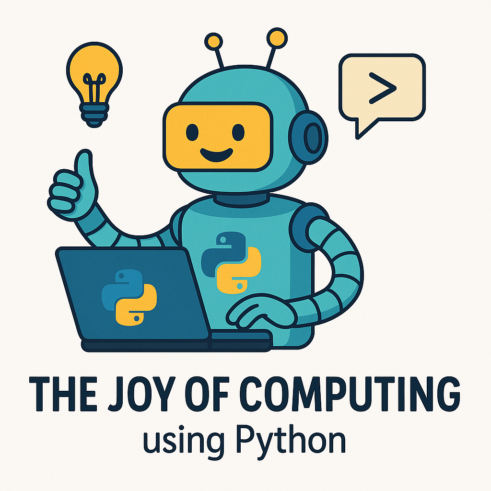

# The Joy of Computing using Python - NPTEL

<p align="center">
  
</p>



[](https://www.python.org/)
[](https://nptel.ac.in/)
[](LICENSE)
[](https://jupyter.org/)
[](https://pandas.pydata.org/)
[](https://numpy.org/)
[](https://matplotlib.org/)
[](https://github.com/ellerbrock/open-source-badge/)
[](https://www.python.org/)


This repository contains all practical Python programs and implementations developed during the NPTEL course **"The Joy of Computing using Python" (NOC25-CS103)**. The focus is on hands-on coding exercises, assignments, and problem-solving implementations covered throughout the course.

## 📚 About the Course

**The Joy of Computing using Python** is an introductory programming course offered by NPTEL that covers fundamental programming concepts through Python. The course emphasizes practical problem-solving and computational thinking.

- **Course Code**: NOC25-CS103
- **Platform**: NPTEL (National Programme on Technology Enhanced Learning)
- **Language**: Python 3.x

## 📂 Repository Structure

The code is organized week-wise following the course curriculum:

```
joy-of-computing-python/
│
├── Week_01/                 # Introduction & Python Basics
│   ├── hello_world.py
│   ├── variables_demo.py
│   └── basic_operations.py
│
├── Week_02/                 # Control Structures
│   ├── conditionals.py
│   ├── loops_demo.py
│   └── pattern_printing.py
│
├── Week_03/                 # Data Structures
│   ├── lists_operations.py
│   ├── tuples_demo.py
│   └── dictionaries.py
│
├── Week_04/                 # Functions & Modules
│   ├── function_examples.py
│   ├── recursive_functions.py
│   └── modules_demo.py
│
├── Week_05/                 # File Handling
│   ├── file_operations.py
│   ├── csv_handling.py
│   └── text_processing.py
│
├── Week_06/                 # Object-Oriented Programming
│   ├── classes_objects.py
│   ├── inheritance_demo.py
│   └── polymorphism.py
│
├── Week_07/                 # Advanced Topics
│   ├── error_handling.py
│   ├── regular_expressions.py
│   └── lambda_functions.py
│
├── Week_08/                 # Libraries & Applications
│   ├── numpy_intro.py
│   ├── matplotlib_demo.py
│   └── web_scraping.py
│
├── Projects/                # Course Projects
│   ├── mini_project_1/
│   ├── mini_project_2/
│   └── final_project/
│
├── Assignments/             # Weekly Assignments
│   ├── assignment_01.py
│   ├── assignment_02.py
│   └── ...
│
├── README.md
├── requirements.txt
└── LICENSE
```

## 🚀 Getting Started

### Prerequisites

- Python 3.7 or higher
- Basic text editor or IDE (VS Code, PyCharm, etc.)

### Installation

1. **Clone the repository**:
   ```bash
   git clone https://github.com/Rajath2005/joy-of-computing-python.git
   cd joy-of-computing-python
   ```

2. **Install dependencies** (if any):
   ```bash
   pip install -r requirements.txt
   ```

### Running the Programs

Navigate to any week's folder and run the Python files:

```bash
# Example: Running Week 1 programs
cd Week_01
python hello_world.py

# Or run directly from root
python Week_02/loops_demo.py
```

## 📅 Course Progress

| Week | Topics Covered | Status |
|------|----------------|---------|
| 1 | Python Basics, Variables, I/O | ✅ |
| 2 | Control Structures, Loops | ✅ |
| 3 | Data Structures (Lists, Tuples, Dicts) | ✅ |
| 4 | Functions, Modules, Packages | ✅ |
| 5 | File Handling, Exception Handling | ✅ |
| 6 | Object-Oriented Programming | ✅ |
| 7 | Advanced Python Concepts | ⏳ |
| 8 | Libraries and Real Applications | ⏳ |

## 💡 Code Organization

Each Python file follows this structure:

```python
"""
Program: [Program Name]
Week: [Week Number]
Topic: [Specific Topic]
Author: Rajath
Date: [Date]
Description: [Brief description of what the program does]
"""

# Code implementation here
```

## 🛠️ Tools & Technologies

- **Language**: Python 3.x
- **Libraries Used**: 
  - Standard Library modules
  - NumPy (for numerical computing)
  - Matplotlib (for data visualization)
  - Requests (for web scraping)
  - And more as covered in the course

## 📋 Key Learning Outcomes

- ✅ Fundamental programming concepts in Python
- ✅ Problem-solving and computational thinking
- ✅ Data structures and algorithms
- ✅ Object-oriented programming principles
- ✅ File handling and data processing
- ✅ Working with Python libraries
- ✅ Real-world application development

## 🤝 Contributing

This is a personal learning repository for the NPTEL course. However, if you find any bugs or have suggestions for improvement:

1. Fork the repository
2. Create a feature branch
3. Make your changes
4. Submit a pull request

## 📝 Notes

- All code is written as part of the learning process
- Programs include comments for better understanding
- Some solutions might have multiple approaches
- Code is organized chronologically by course weeks

## 📖 Course Resources

- [Official NPTEL Course Page](https://nptel.ac.in/)
- [Python Official Documentation](https://docs.python.org/3/)
- [Course Video Lectures](https://nptel.ac.in/)

## 📄 License

This project is licensed under the MIT License - see the [LICENSE](LICENSE) file for details.

## 👨‍💻 Author

**Rajath**
- GitHub: [@Rajath2005](https://github.com/Rajath2005)
- Course: The Joy of Computing using Python (NPTEL)

---

⭐ **Star this repository** if you found it helpful for your NPTEL course journey!

📚 **Happy Coding and Learning!** 🐍
